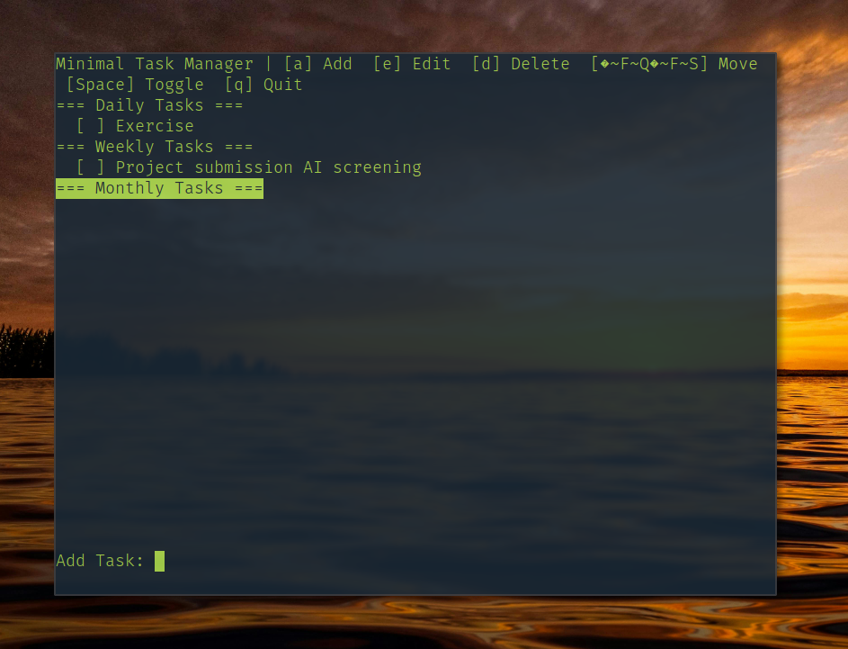

# 📋 Minimal Task Manager

A lightweight, terminal-based task manager built with C++ and ncurses. Organize your tasks into daily, weekly, and monthly categories with a clean, keyboard-driven interface.

## ✨ Features

- **Three Task Categories**: Organize tasks by daily, weekly, and monthly schedules
- **Keyboard Navigation**: Intuitive arrow key navigation and single-key commands
- **Persistent Storage**: Tasks are automatically saved to disk in binary format
- **Toggle Completion**: Mark tasks as complete/incomplete with a single keystroke
- **Inline Editing**: Add, edit, and delete tasks without leaving the interface
- **Minimal Design**: Clean, distraction-free terminal interface

## 📸 Screenshot


*Screenshot showing the task manager interface with daily, weekly, and monthly task sections*

## 🚀 Download

[](https://github.com/AdityaKapare03/task-manager-CLI/releases/download/v1.0/task-manager-1.0.deb)

**[📥 Download the latest version](https://github.com/AdityaKapare03/task-manager-CLI/releases/download/v1.0/task-manager-1.0.deb)**

## 🔧 Installation

### Prerequisites
- C++ compiler (g++)
- ncurses library

### Installing ncurses

**Ubuntu/Debian:**
```bash
sudo apt-get install libncurses5-dev libncursesw5-dev
```

**macOS:**
```bash
brew install ncurses
```

**Arch Linux:**
```bash
sudo pacman -S ncurses
```

### Building from Source

1. Clone or download the repository
2. Navigate to the project directory
3. Compile using the provided Makefile:
```bash
make
```

This will create the `task-manager` executable.

## 🎮 Usage

### Starting the Application
```bash
./task-manager
```

### Keyboard Controls

| Key | Action |
|-----|--------|
| `↑` `↓` | Navigate between tasks and sections |
| `a` | Add new task (works on headers and tasks) |
| `e` | Edit selected task |
| `d` | Delete selected task |
| `Space` | Toggle task completion (✓/✗) |
| `q` | Quit and save |

### Task Organization

The application organizes tasks into three categories:

- **📅 Daily Tasks**: Tasks for daily completion
- **📆 Weekly Tasks**: Tasks for weekly completion  
- **🗓️ Monthly Tasks**: Tasks for monthly completion

### Adding Tasks

1. Navigate to any section using arrow keys
2. Press `a` to add a new task
3. Type your task description and press Enter
4. The task will be added to the appropriate section

### Managing Tasks

- **Complete a task**: Navigate to the task and press `Space`
- **Edit a task**: Navigate to the task and press `e`
- **Delete a task**: Navigate to the task and press `d`

### Data Persistence

Tasks are automatically saved to `tasks.dat` in binary format when you quit the application. The file is loaded automatically when you start the program.

## 🏗️ Project Structure

```
task-manager/
├── main.cpp        # Main application source
├── Makefile        # Build configuration
├── .gitignore      # Git ignore rules
├── tasks.dat       # Task data file (created automatically)
└── README.md       # This file
```

## 🔧 Technical Details

- **Language**: C++
- **UI Library**: ncurses
- **Data Storage**: Binary file format
- **Compiler**: g++ with C++11 support

## 📝 File Formats

The application uses a custom binary format for task storage:
- Each task contains text content and completion status
- Tasks are organized by category (daily/weekly/monthly)
- File is automatically created and managed

## 🤝 Contributing

Feel free to submit issues, feature requests, or pull requests to improve the task manager!

## 📄 License

This project is open source. Please check the license file for details.

## 🐛 Troubleshooting

### Common Issues

**"ncurses not found" error:**
- Make sure ncurses development libraries are installed
- On some systems, you may need to link with `-lncursesw` instead of `-lncurses`

**Terminal display issues:**
- Ensure your terminal supports ncurses
- Try resizing the terminal window
- Check that your terminal has adequate dimensions

**Build errors:**
- Verify g++ is installed and accessible
- Check that all source files are present
- Ensure you have write permissions in the directory

---

*Built with ❤️ for productivity and simplicity*
